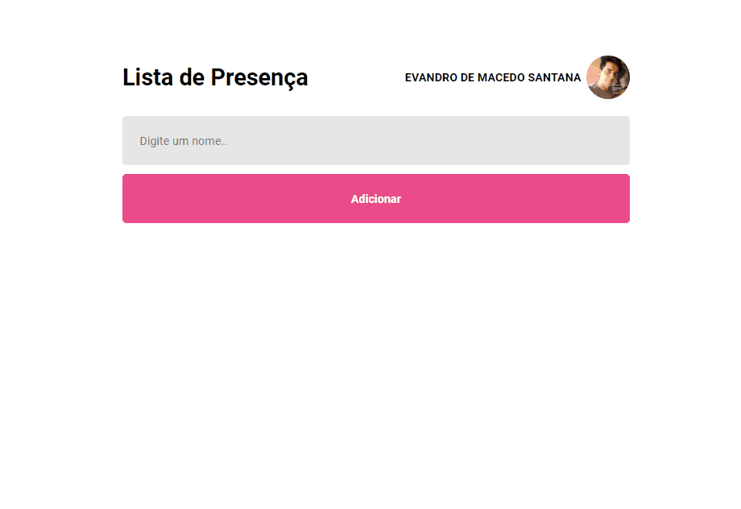

<p align="center">
  
</p>


## 🧪 Tecnologias

Projeto desenvolvido utilizando as seguintes tecnologias:

- [ReactJS](https://reactjs.org/)
- [Vite](https://vitejs.dev/)

## 🚀 Getting started

Clone o projeto e acessando.

```bash
git clone https://github.com/evandromsantana/-lista_presenca

cd lista_presenca

```

Run this command to install the dependencies.

```bash
yarn install

yarn dev
```

## 📝 License

---

<p>Made with 💜 by Evandro de Macêdo Santana</p>

<a  href="https://www.linkedin.com/in/evandro-m-santana" target="_blank"></a>

✉️ email:
evandromsantana@hotmail.com

☎️ Tel: 
(89)98121-9879
 
